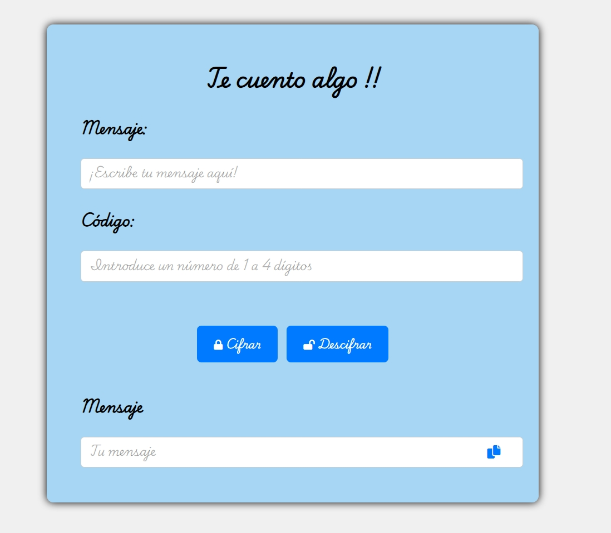

# 📍 PROYECTO #2  

# 🔐 ENCRIPTACION Y DESENCRIPTACION DE MENSAJES


# 👯‍♀️ Integrantes
 1- Lucy 
 2- Nohemy
 3- Mery
 4- Vanessa

## 🚀 Descripción

Este proyecto permite cifrar y decifrar mensajes, asegurando que solo las personas con el codigo correcto puedan leer el contenido, ideal para compartir informacion sensible.
 
## 🌍 principales usuarios

 * Personas de todas las edades a 
 * partir de los 15 años

 ## 🛸 objetivos 

 * Desarrolladores principiantes: que busquen proyectos practicos para mejorar sus habilidades en JS, HTML, CSS.
 * Usuarios de mensajeria segura: quienes busquen herramientas simples y efectivas para cifrar y descifrar mensajes antes de enviarlos a traves de canales de comunicacion no seguros.
 * Educadores: que deseen utilizar ejemplos practicos como este para enseñar a estudiantes sobre seguridad informatica y criptografia.

 ## 👩‍🚀 como soluciona o resuelve los problemas con el producto?

  * Este proyecto no solo aborda la seguridad y la privacidad de la informacion, sino que tambien promueve el aprendizaje educativo y la practica de habilidades de desarrollo.


# 📁 Organizacion de Archivos
```
|—— assets
|    |—— css
|        |—— style.css
|    |—— img
|        |—— candado.png  
|    |—— js
|        |—— main.js
|—— index.html
```
# 🏜️ Imagen


